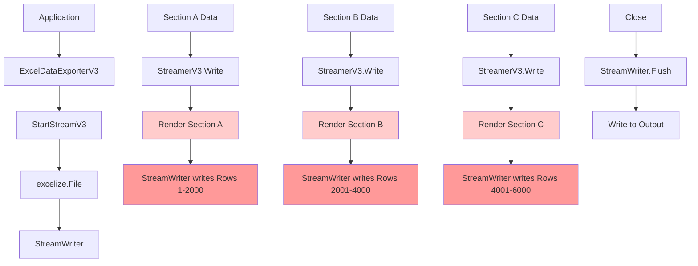
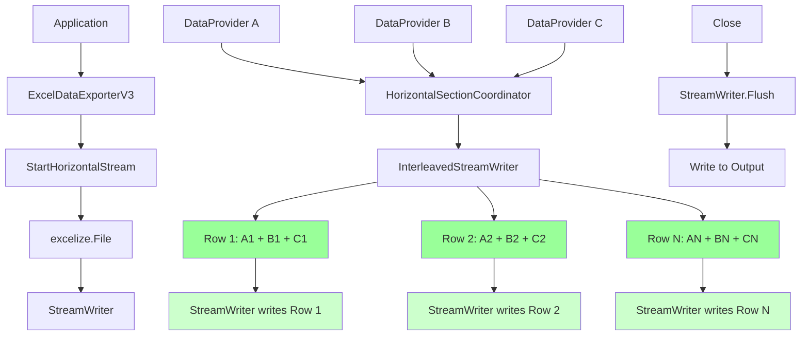
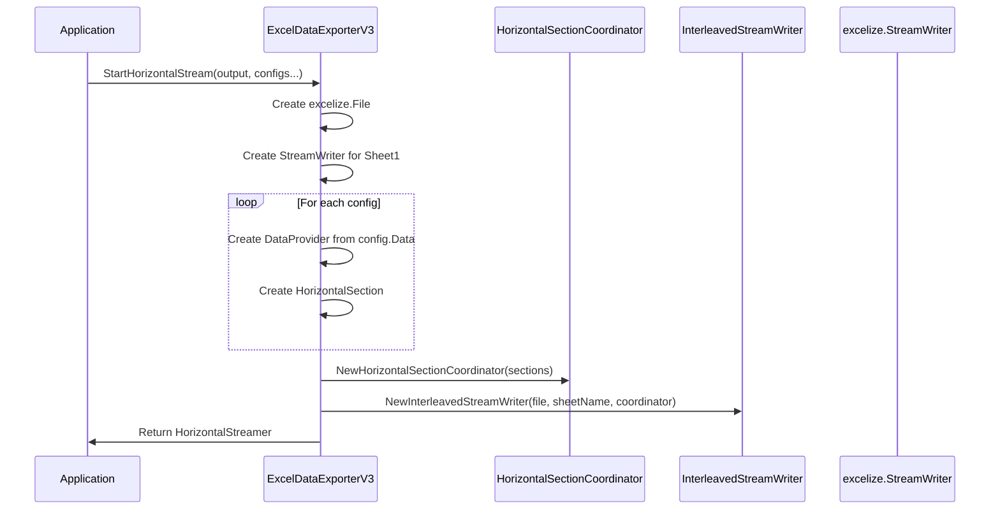
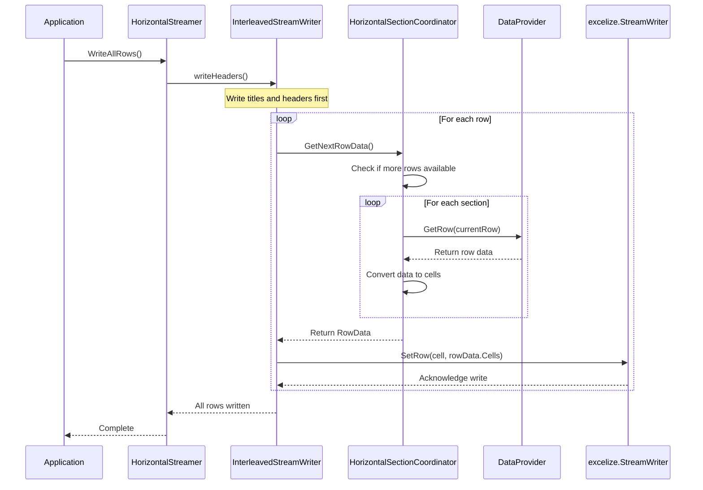
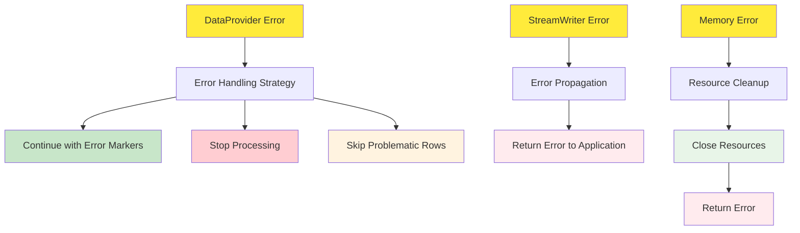
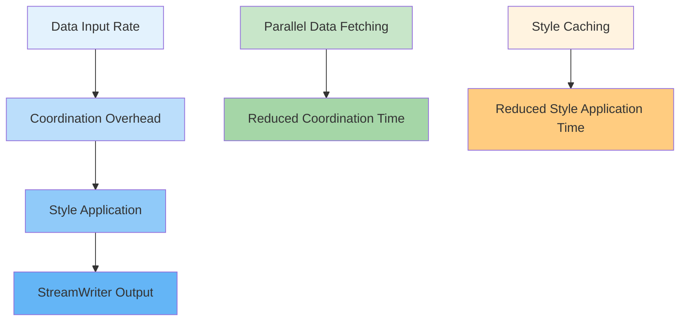
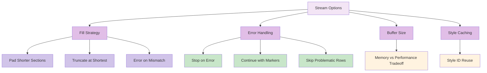

# Data Flow Diagram: Horizontal Streaming Architecture

## Overview

This document provides visual and textual descriptions of the data flow for the refactored ExcelDataExporterV3 horizontal streaming implementation.

## Current Architecture (Vertical Streaming)



**Problem**: Sections are written sequentially, making horizontal layout impossible.

## New Architecture (Horizontal Streaming)



**Solution**: Data is interleaved row-by-row, enabling horizontal section layout.

## Detailed Data Flow

### 1. Initialization Phase



### 2. Data Processing Phase



### 3. Data Provider Flow

```mermaid
graph TD
    A[Slice Data] --> B[SliceDataProvider]
    C[Channel Data] --> D[ChannelDataProvider]
    E[Custom Iterator] --> F[IteratorDataProvider]

    B --> G[GetRow(rowIndex)]
    D --> G
    F --> G

    G --> H[Extract Field Values]
    H --> I[Apply Formatters]
    I --> J[Return Processed Data]

    style B fill:#e1f5fe
    style D fill:#e1f5fe
    style F fill:#e1f5fe
    style G fill:#b3e5fc
    style H fill:#81d4fa
    style I fill:#4fc3f7
    style J fill:#29b6f6
```

## Memory Flow Analysis

### Vertical Streaming Memory Usage

```mermaid
graph LR
    A[Row 1] --> B[Row 2] --> C[Row 3] --> D[...]
    D --> E[Row N]

    F[Memory: O(1)] --> G[Constant per section]

    style A fill:#ffcccc
    style B fill:#ffcccc
    style C fill:#ffcccc
    style D fill:#ffcccc
    style E fill:#ffcccc
    style F fill:#ffeeee
    style G fill:#ffeeee
```

### Horizontal Streaming Memory Usage

```mermaid
graph LR
    A[Row 1: Section A + B + C] --> B[Row 2: Section A + B + C]
    B --> C[Row 3: Section A + B + C] --> D[...]
    D --> E[Row N: Section A + B + C]

    F[Memory: O(sections)] --> G[Per-row coordination]

    style A fill:#ccffcc
    style B fill:#ccffcc
    style C fill:#ccffcc
    style D fill:#ccffcc
    style E fill:#ccffcc
    style F fill:#eeffee
    style G fill:#eeffee
```

## Error Handling Flow



## Performance Characteristics

### Time Complexity

- **Vertical Streaming**: O(total_rows) - linear in total data size
- **Horizontal Streaming**: O(total_rows × sections) - linear in total data size × number of sections

### Space Complexity

- **Vertical Streaming**: O(1) per section - constant memory
- **Horizontal Streaming**: O(sections) per row - scales with number of sections

### Throughput Analysis



## Configuration Flow



This data flow diagram illustrates how the new horizontal streaming architecture coordinates multiple data providers to achieve interleaved row writing, enabling horizontal section layouts while maintaining streaming efficiency.
