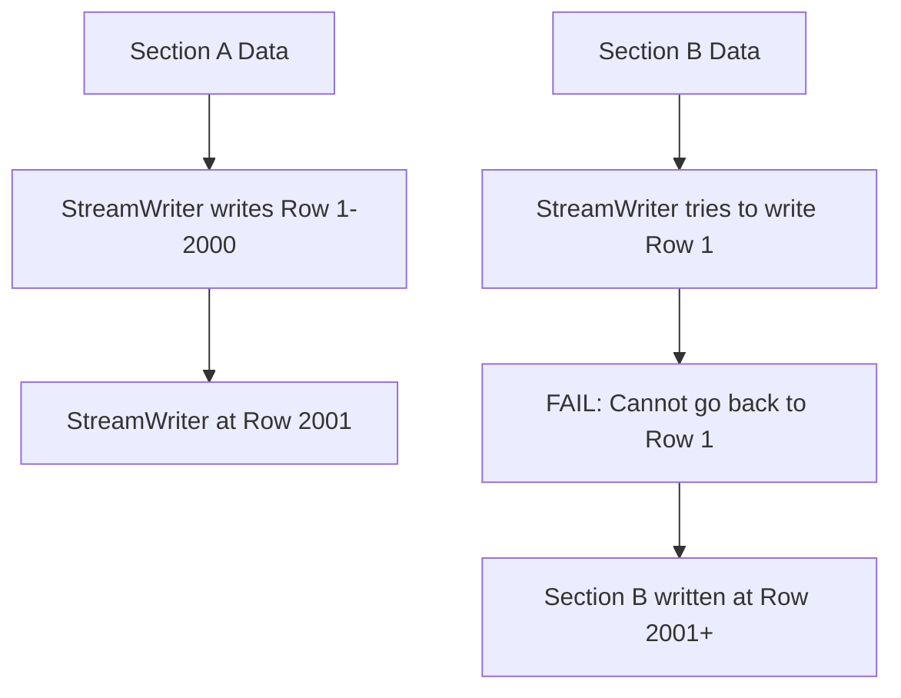
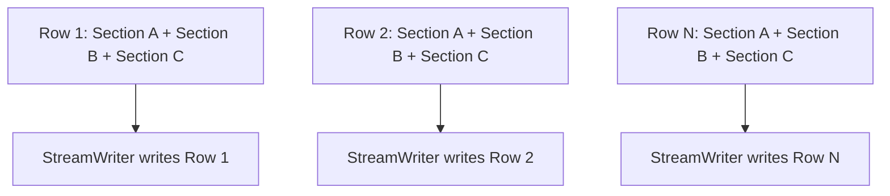

# Horizontal Streaming Refactoring for ExcelDataExporterV3

## Problem Statement

The current ExcelDataExporterV3 architecture cannot support horizontal section streaming due to the fundamental limitation of `excelize.StreamWriter` working like a "typewriter" - it writes row-by-row sequentially and cannot go back to previous rows to add data from subsequent sections.

### Current Architecture Limitation



### Technical Constraint

- **StreamWriter Behavior**: Once a row is written, the stream advances and cannot be rewound
- **Memory Efficiency**: Streaming is designed to avoid loading entire datasets into memory
- **Row-by-Row Commitment**: Each row is immediately committed to the file to free memory

## Proposed Solution: Interleaved Writing Architecture

### Core Concept

Instead of writing sections sequentially, we need to write them **interleaved** - row by row, combining data from all horizontal sections for each row before writing to the stream.



### New Architecture Components

#### 1. HorizontalSectionCoordinator

```go
type HorizontalSectionCoordinator struct {
    sections []*HorizontalSection
    // Coordinates data flow between multiple sections
}

type HorizontalSection struct {
    ID           string
    DataProvider DataProvider
    Columns      []ColumnConfigV3
    RowCount     int
    CurrentRow   int
}
```

#### 2. DataProvider Interface

```go
type DataProvider interface {
    // GetRow returns data for a specific row index
    GetRow(rowIndex int) (interface{}, error)
    // GetRowCount returns total number of rows (may be unknown)
    GetRowCount() (int, bool)
    // HasMoreRows returns true if more rows are available
    HasMoreRows() bool
    // NextRow advances to next row and returns data
    NextRow() (interface{}, error)
}
```

#### 3. InterleavedStreamWriter

```go
type InterleavedStreamWriter struct {
    file          *excelize.File
    sheetName     string
    streamWriter  *excelize.StreamWriter
    coordinator   *HorizontalSectionCoordinator
    currentRow    int
    styleCache    map[string]int
}
```

## Implementation Strategy

### Phase 1: Core Infrastructure

1. **Create DataProvider implementations**:

   - `SliceDataProvider`: For in-memory slices
   - `ChannelDataProvider`: For streaming data from channels
   - `IteratorDataProvider`: For custom iteration logic

2. **Implement HorizontalSectionCoordinator**:

   - Manages multiple sections in horizontal layout
   - Ensures row alignment across sections
   - Handles sections with different row counts

3. **Create InterleavedStreamWriter**:
   - Combines data from multiple sections per row
   - Writes complete rows to StreamWriter
   - Manages style application efficiently

### Phase 2: API Integration

1. **New Streaming Methods**:

   ```go
   // New method for horizontal streaming
   func (e *ExcelDataExporterV3) StartHorizontalStream(w io.Writer, sections ...*HorizontalSectionConfig) (*HorizontalStreamer, error)

   // Enhanced existing method with mode parameter
   func (e *ExcelDataExporterV3) StartStreamV3(w io.Writer, mode StreamMode) (*StreamerV3, error)
   ```

2. **Configuration Options**:

   ```go
   type StreamMode int

   const (
       StreamModeVertical StreamMode = iota
       StreamModeHorizontal
   )

   type HorizontalSectionConfig struct {
       ID           string
       DataProvider DataProvider
       Columns      []ColumnConfigV3
       Title        interface{}
       ShowHeader   bool
   }
   ```

### Phase 3: Backward Compatibility

1. **Maintain existing API**:

   - Keep `StartStreamV3()` with vertical streaming as default
   - Add optional parameters for mode selection
   - Ensure existing code continues to work

2. **Migration Path**:
   - Provide helper functions to convert existing data to DataProvider
   - Add deprecation warnings for patterns that won't work with horizontal streaming

## Technical Challenges & Solutions

### Challenge 1: Memory Management

**Problem**: Interleaved writing requires holding row data from multiple sections in memory.

**Solution**:

- Use buffered channels with configurable buffer sizes
- Implement row-level caching with LRU eviction
- Support streaming data providers that don't require full dataset in memory

### Challenge 2: Row Count Synchronization

**Problem**: Sections may have different numbers of rows.

**Solution**:

- Use padding with empty cells for shorter sections
- Implement "fill strategy" configuration (pad, truncate, error)
- Support dynamic row counting for streaming data

### Challenge 3: Performance Optimization

**Problem**: Combining data from multiple sources per row could be slow.

**Solution**:

- Pre-compute style IDs and column mappings
- Use object pooling for row data structures
- Implement parallel data fetching where possible

### Challenge 4: Error Handling

**Problem**: Errors in one section could affect others in the same row.

**Solution**:

- Implement section-level error isolation
- Provide error recovery strategies
- Support partial row writing with error markers

## Usage Examples

### Basic Horizontal Streaming

```go
// Create data providers
providerA := NewSliceDataProvider(sectionAData)
providerB := NewSliceDataProvider(sectionBData)

// Configure horizontal sections
config := &HorizontalSectionConfig{
    ID: "section_a",
    DataProvider: providerA,
    Columns: []ColumnConfigV3{
        {FieldName: "Name", Header: "Name"},
        {FieldName: "Value", Header: "Value"},
    },
    Title: "Section A",
}

// Start horizontal stream
streamer, err := exporter.StartHorizontalStream(output, config)
if err != nil {
    return err
}
defer streamer.Close()

// Write all rows
err = streamer.WriteAllRows()
```

### Advanced Configuration

```go
// Configure with custom options
options := &HorizontalStreamOptions{
    BufferSize: 100,
    FillStrategy: FillStrategyPad,
    ErrorHandling: ErrorHandlingContinue,
}

streamer, err := exporter.StartHorizontalStreamWithOptions(output, options, configs...)
```

## Performance Considerations

### Memory Usage

- **Vertical Streaming**: O(1) memory per section
- **Horizontal Streaming**: O(number_of_sections) memory per row
- **Mitigation**: Use streaming data providers and configurable buffers

### Processing Speed

- **Vertical Streaming**: Single section processing
- **Horizontal Streaming**: Multi-section coordination overhead
- **Optimization**: Parallel data fetching and pre-computed styles

### File Size

- **Vertical Streaming**: Standard Excel file size
- **Horizontal Streaming**: Same file size (data is identical)
- **Consideration**: No additional overhead from interleaving

## Migration Guide

### For Existing Vertical Streaming Code

```go
// Current (still works)
streamer, err := exporter.StartStreamV3(output)
streamer.Write("section1", data1)
streamer.Write("section2", data2)

// New horizontal streaming
streamer, err := exporter.StartHorizontalStream(output, configs...)
streamer.WriteAllRows()
```

### For New Horizontal Streaming

```go
// Convert existing data to DataProvider
provider := NewSliceDataProvider(existingData)

// Configure section
config := &HorizontalSectionConfig{
    ID: "my_section",
    DataProvider: provider,
    Columns: columns,
}

// Use new API
streamer, err := exporter.StartHorizontalStream(output, config)
```

## Testing Strategy

### Unit Tests

- Test DataProvider implementations
- Test HorizontalSectionCoordinator logic
- Test InterleavedStreamWriter functionality

### Integration Tests

- Test complete horizontal streaming workflow
- Test error handling and recovery
- Test performance with large datasets

### Compatibility Tests

- Ensure existing vertical streaming still works
- Test migration scenarios
- Validate backward compatibility

## Conclusion

This refactoring enables horizontal section streaming by fundamentally changing the data flow architecture from sequential section writing to interleaved row writing. While this requires significant changes to the streaming implementation, it maintains backward compatibility and provides a powerful new capability for large dataset exports.

The key insight is that horizontal streaming requires **synchronized data access** across multiple sections, which is fundamentally different from the current **sequential section processing** model.
